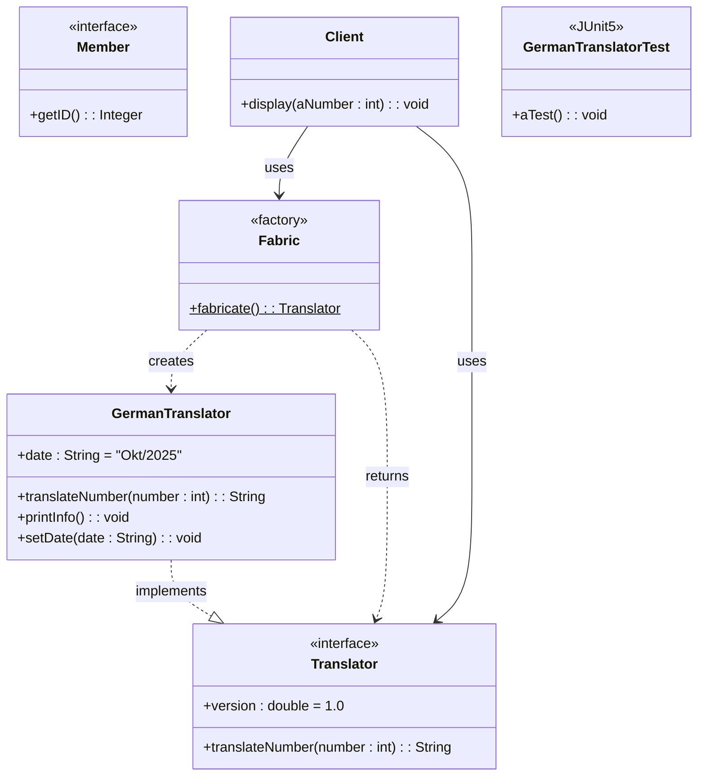

## UML-Klassendiagramm des Projekts

```mermaid
classDiagram
    %% Interfaces
    class Translator {
        <<interface>>
        +version : double = 1.0
        +translateNumber(number : int) : String
    }
    
    class Member {
        <<interface>>
        +getID() : Integer
    }
    
    %% Control Layer - Übung 1
    class GermanTranslator {
        +date : String = "Okt/2025"
        +translateNumber(number : int) : String
        +printInfo() : void
        +setDate(date : String) : void
    }
    
    class Fabric {
        <<factory>>
        +fabricate()$ : Translator
    }
    
    %% View Layer - Übung 1
    class Client {
        +display(aNumber : int) : void
    }
    
    %% Test Layer
    class GermanTranslatorTest {
        <<JUnit5>>
        +aTest() : void
    }
    
    %% Relationships
    GermanTranslator ..|> Translator : implements
    Fabric ..> GermanTranslator : creates
    Fabric ..> Translator : returns
    Client --> Fabric : uses
    Client --> Translator : uses
```
