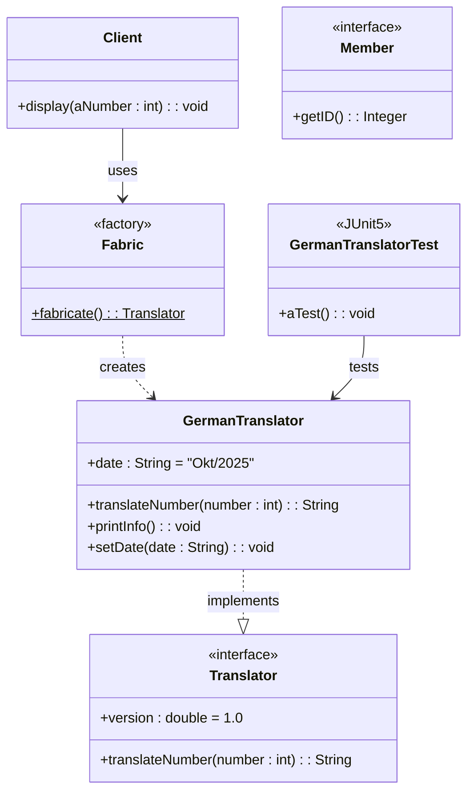

## Übungsübersicht

### 📁 [Übung 1: Factory Design Pattern](src/org/hbrs/se1/ws25/exercises/uebung1/README.md)
- **Thema**: Factory Pattern, Interface Implementation
- **Implementiert**: GermanTranslator, Factory-Klasse, JUnit Tests
- **Status**: ✅ Abgeschlossen

### 📁 [Übung 2: TBD](src/org/hbrs/se1/ws25/exercises/uebung2/README.md)
- **Status**: ⏳ Wartet auf Aufgabenstellung

### 📁 [Übung 3: TBD](src/org/hbrs/se1/ws25/exercises/uebung3/README.md)
- **Status**: ⏳ Wartet auf Aufgabenstellung

### 📁 [Übung 4: TBD](src/org/hbrs/se1/ws25/exercises/uebung4/README.md)
- **Status**: ⏳ Wartet auf Aufgabenstellung

### 📁 [Übung 5: TBD](src/org/hbrs/se1/ws25/exercises/uebung5/README.md)
- **Status**: ⏳ Wartet auf Aufgabenstellung

### 📁 [Übung 6: TBD](src/org/hbrs/se1/ws25/exercises/uebung6/README.md)
- **Status**: ⏳ Wartet auf Aufgabenstellung

### 📁 [Übung 7: TBD](src/org/hbrs/se1/ws25/exercises/uebung7/README.md)
- **Status**: ⏳ Wartet auf Aufgabenstellung

### 📁 [Übung 8: TBD](src/org/hbrs/se1/ws25/exercises/uebung8/README.md)
- **Status**: ⏳ Wartet auf Aufgabenstellung

## Projekt-Gesamtübersicht

