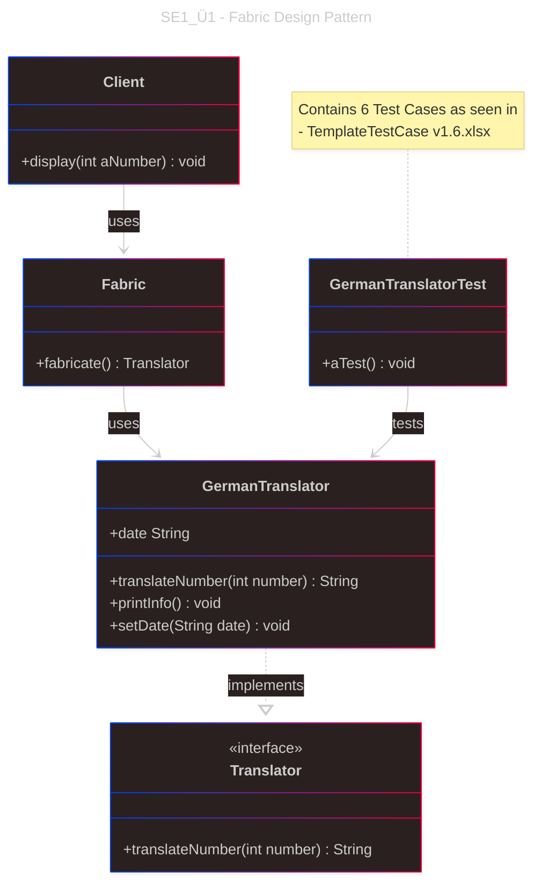

# Übung 1: Factory Design Pattern 

## UML-Diagramm




### Funktionalität
- Übersetzung von Zahlen (1-10) ins Deutsche
- Fehlerbehandlung für ungültige Zahlen
- Factory Pattern für die Instanziierung


## Implementierte Klassen

### Control Layer
- **`Translator`** (Interface): Definiert die Schnittstelle für Übersetzer
- **`GermanTranslator`**: Implementiert die deutsche Zahlenübersetzung
- **`Fabric`**: Factory-Klasse zur Erzeugung von Translator-Instanzen

### View Layer
- **`Client`**: Präsentationsschicht für die Ausgabe

## Tests

- **`GermanTranslatorTest`**: JUnit 5 Tests für positive und negative Testfälle
- Testet Zahlen 1-10 (gültige Eingaben)
- Testet ungültige Eingaben (0, 11, negative Zahlen)

## Verwendung

```java
// Factory Pattern verwenden
Translator translator = Fabric.fabricate();

// Zahl übersetzen
String result = translator.translateNumber(5); // "fünf"

// Client für Ausgabe verwenden
Client client = new Client();
client.display(5); // Gibt "Das Ergebnis der Berechnung: fünf" aus
```

## Design Patterns

- **Factory Pattern**: `Fabric.fabricate()` erstellt `GermanTranslator`-Instanzen

## Status
✅ **Abgeschlossen** - Vollständig implementiert und getestet
